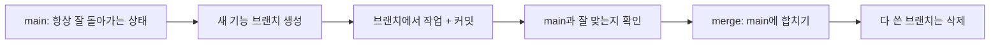
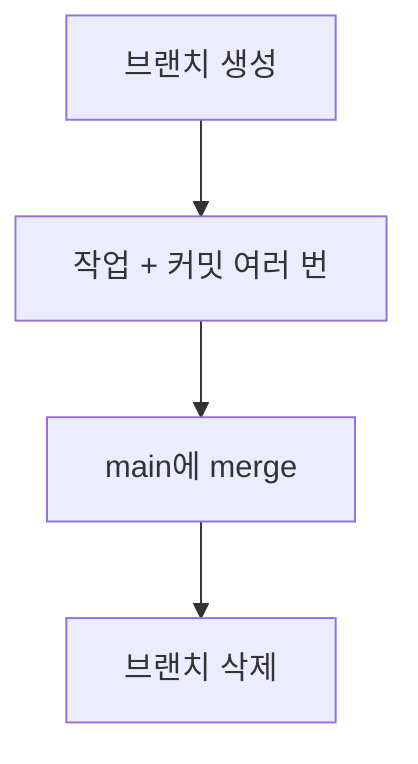

## 오늘 배운 것

브랜치를 만들 줄은 알게 됐는데, "그래서 언제, 어떻게 나눠 써야 하나"가 궁금해서 초보자용 기본 전략을 정리해봤다.
큰 규칙은 하나다. **main은 항상 안전한 상태로 두고, 새 작업은 브랜치에서 한다.**

### 기본 흐름

## 왜 브랜치를 나눠서 쓰나

| 상황 | main에서 바로 작업하면 | 브랜치에서 작업하면 |
|---|---|---|
| 기능을 만들다가 실수함 | main 자체가 망가짐 | 그 브랜치만 지우면 그만 |
| 여러 기능을 동시에 진행 | 서로 코드가 뒤섞임 | 브랜치별로 분리됨 |
| 완성 안 된 걸 남에게 보여줘야 함 | main이 불안정해서 곤란함 | main은 그대로 안전함 |

## 기본 규칙 표

|규칙 | 언제 지키나|
|---|---|
|main은 직접 건드리지 않는다| 새로운 작업을 시작할 때|
|브랜치 하나에는 작업 하나만| 브랜치를 만들 때|
|이름은 무슨 작업인지 알 수 있게 짓는다| 브랜치를 만들 때 (예: `login-form`, `fix-typo`)|
|작업이 끝나면 바로 main에 합친다| merge할 때|
|합친 브랜치는 지운다| merge가 끝난 직후|

## 브랜치 하나의 일생

## 막혔던 것

브랜치를 계속 살려두고 여러 개 동시에 작업하다 보니, 어떤 브랜치가 뭘 하던 건지 헷갈렸다.
찾아보니 이유는 **브랜치를 너무 오래 들고 있어서**였다.
작업 하나 끝나면 바로바로 merge하고 지우는 습관을 들이면 이런 문제가 줄어든다고 한다.

## 오늘 정리

- 브랜치 전략의 핵심은 "main은 안전하게, 새 작업은 브랜치에서"였다.
- 브랜치는 작업 단위로 짧게 만들고, 끝나면 바로 merge 후 삭제하는 게 초보자에게 가장 헷갈리지 않는 방식이다.
