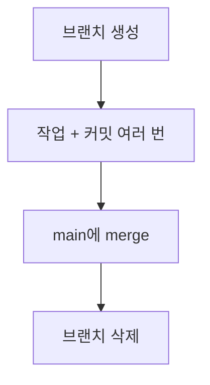

브랜치를 만드는 방법은 알게 됐는데, 그래서 언제 어떻게 나눠 써야 할까? 초보자용 기본 전략을 정리했다.

> **TL;DR**
> - main은 항상 안전한 상태로 두고, 새 작업은 브랜치에서 한다.
> - 브랜치는 작업 하나당 하나씩 짧게 만들고, 끝나면 바로 merge한 뒤 삭제한다.
> - 브랜치를 오래 들고 있으면 무슨 작업이었는지 헷갈린다.

## 브랜치는 어떤 흐름으로 쓸까

```mermaid
flowchart LR
    A[main: 항상 잘 돌아가는 상태] --> B[새 기능 브랜치 생성]
    B --> C[브랜치에서 작업 + 커밋]
    C --> D[main과 잘 맞는지 확인]
    D --> E[merge: main에 합치기]
    E --> F[다 쓴 브랜치는 삭제]
```

## 왜 main에서 바로 작업하지 않을까

| 상황 | main에서 바로 작업하면 | 브랜치에서 작업하면 |
|---|---|---|
| 기능을 만들다가 실수함 | main 자체가 망가짐 | 그 브랜치만 지우면 그만 |
| 여러 기능을 동시에 진행 | 서로 코드가 뒤섞임 | 브랜치별로 분리됨 |
| 완성 안 된 걸 남에게 보여줘야 함 | main이 불안정해서 곤란함 | main은 그대로 안전함 |

## 브랜치를 쓸 때 지킬 규칙 5가지

|규칙 | 언제 지키나|
|---|---|
|main은 직접 건드리지 않는다| 새로운 작업을 시작할 때|
|브랜치 하나에는 작업 하나만| 브랜치를 만들 때|
|이름은 무슨 작업인지 알 수 있게 짓는다| 브랜치를 만들 때 (예: `login-form`, `fix-typo`)|
|작업이 끝나면 바로 main에 합친다| merge할 때|
|합친 브랜치는 지운다| merge가 끝난 직후|

## 브랜치 하나는 어떤 과정을 거칠까

```mermaid
flowchart TD
    A[브랜치 생성] --> B[작업 + 커밋 여러 번]
    B --> C[main에 merge]
    C --> D[브랜치 삭제]
```

## 헷갈렸던 점: 브랜치를 너무 오래 들고 있었다

브랜치를 계속 살려두고 여러 개를 동시에 작업하다 보니, 어떤 브랜치가 뭘 하던 건지 헷갈렸다.
찾아보니 이유는 **브랜치를 너무 오래 들고 있어서**였다.
작업 하나가 끝나면 바로 merge하고 지우는 습관을 들이면 이런 문제가 줄어든다고 한다.

## 정리

- 브랜치 전략의 핵심은 "main은 안전하게, 새 작업은 브랜치에서"이다.
- 브랜치는 작업 단위로 짧게 만들고, 끝나면 바로 merge 후 삭제한다. 초보자에게는 이 방식이 가장 덜 헷갈린다.
- 다음에는 실제로 브랜치를 만들고 merge하는 과정을 직접 해볼 예정이다.

## 참고 자료

- [Pro Git - Branches in a Nutshell](https://git-scm.com/book/en/v2/Git-Branching-Branches-in-a-Nutshell)
