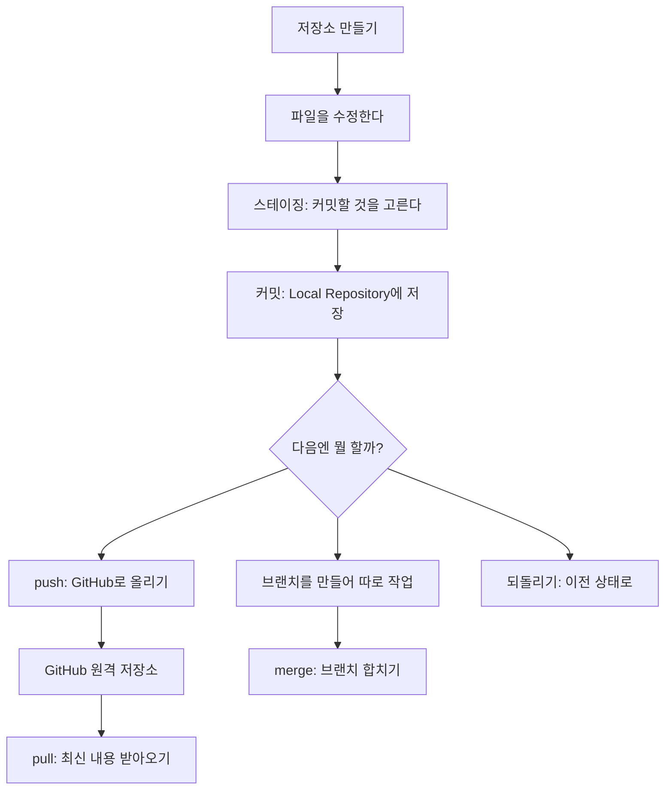
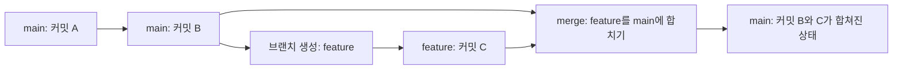
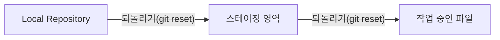

# Git 명령어 정리

오늘 배운 Git 명령어를 정리합니다.

## 오늘 배운 것
이번 주는 Git으로 "내가 만든 파일을 저장하고, 되돌리고, GitHub와 주고받는" 전체 흐름을 배웠다.
아직 처음이라 헷갈릴 수 있으니, 오늘은 **딱 이번 주에 배운 명령어만** 순서대로 정리해본다.

### 전체 흐름 한눈에 보기

## 명령어 정리표

|명령어 | 언제 쓰나|
|---|---|
|git init| 새 프로젝트를 Git으로 관리하기 시작할 때 (저장소 만들기)|
|git add| 고친 파일 중에서 커밋할 것만 골라 담고 싶을 때 (스테이징)|
|git commit| 스테이징한 내용을 Local Repository에 저장 지점으로 남기고 싶을 때|
|git branch| 지금 작업과 별개로 새로운 갈래(브랜치)를 만들고 싶을 때|
|git push| 내 컴퓨터(Local Repository)의 기록을 GitHub로 올리고 싶을 때|
|git pull| GitHub에 있는 최신 기록을 내 컴퓨터로 받아오고 싶을 때|
|git merge| 서로 다른 브랜치에서 한 작업을 하나로 합치고 싶을 때|
|git reset| 스테이징하거나 커밋한 걸 취소하고 이전 상태로 되돌리고 싶을 때|

## 하나씩 자세히 보기

### 1. 저장소 만들기 (git init)

`git init`을 실행하면 그 폴더가 "Git이 지켜보는 폴더"가 된다.
비유하자면, 앨범을 하나 새로 만드는 것과 같다. 이 앨범 안에서만 사진(저장 지점)을 찍어 모을 수 있다.

### 2. 스테이징 (git add)

파일을 여러 개 고쳤어도, 한 번에 다 커밋할 필요는 없다.
`git add`는 "이번 저장 지점에는 이 파일들만 넣을래" 하고 고르는 단계다.

### 3. Local Repository란?

`git commit`을 하면 그 결과가 저장되는 곳이 바로 **Local Repository**, 즉 내 컴퓨터 안의 저장소다.
아직 GitHub(원격 저장소)에는 올라가지 않은, 내 컴퓨터 안에서만의 기록이라는 점이 중요하다.

### 4. 커밋 (git commit)

스테이징한 파일들을 하나의 저장 지점으로 확정 짓는 단계다.
`git commit`을 하고 나면 그 순간의 모습이 Local Repository에 사진처럼 남는다.

### 5. 브랜치 (git branch)

브랜치는 "원래 작업은 그대로 둔 채로, 따로 실험해볼 수 있는 갈래"다.
아래 그림처럼, 갈라져 나간 브랜치는 나중에 merge로 다시 합칠 수 있다.

### 6. push

`git push`는 Local Repository에 쌓아둔 커밋들을 GitHub(원격 저장소)로 올리는 것이다.
이걸 해야 다른 사람도, 그리고 다른 컴퓨터에서도 내 기록을 볼 수 있다.

### 7. pull

`git pull`은 반대로 GitHub에 있는 최신 기록을 내 Local Repository로 가져오는 것이다.
같이 작업하거나, 다른 컴퓨터에서 작업했을 때 꼭 먼저 해줘야 하는 명령이다.

### 8. merge

`git merge`는 서로 다른 브랜치에서 만든 커밋들을 하나로 합치는 작업이다.
브랜치에서 실험한 결과가 마음에 들면, main 브랜치로 합쳐서 정식으로 반영한다.

### push와 pull의 흐름

### 9. 되돌리기 (git reset)

작업하다 보면 "아, 이거 아까로 되돌리고 싶다" 하는 순간이 온다.
`git reset`은 스테이징하거나 커밋한 것을 취소하고 이전 상태로 돌아가게 해준다.

## 막혔던 것

저장소 만들기, 스테이징, 커밋까지는 한 컴퓨터 안에서 끝나는 일이고,
push와 pull부터는 GitHub라는 원격 저장소와 주고받는 일이라는 걸 구분하는 게 처음엔 헷갈렸다.
"Local Repository까지는 내 컴퓨터, push를 해야 비로소 GitHub"라고 기억하니 정리가 됐다.

## 이번 주 정리

- 저장소 만들기 → 스테이징 → 커밋(Local Repository) → 브랜치 → push/pull → merge → 되돌리기, 이 순서를 한 그림으로 이해했다.
- Local Repository와 GitHub(원격 저장소)는 다른 곳이며, push/pull로 서로 연결된다는 것을 배웠다.
