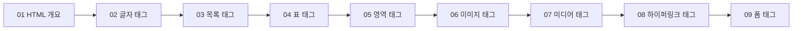

# HTML 기본 태그 정리

오늘은 HTML 개요부터 폼 태그까지, 웹 페이지를 만들 때 쓰는 기본 태그들을 쭉 훑었다. 범위가 넓어서 하나씩 정리해둔다.

## 전체 흐름 한눈에 보기



## 01. HTML 개요

HTML은 웹 페이지의 **구조**를 만드는 마크업 언어다. 태그로 "이 부분은 제목이다", "이 부분은 표다" 같은 의미를 부여하고, 실제 디자인(CSS)이나 동작(JavaScript)은 다른 언어가 맡는다는 역할 분담을 배웠다.

## 02. 글자 관련 태그

| 태그 | 의미 |
|---|---|
| `h1`~`h6` | 제목(숫자가 작을수록 중요한 제목) |
| `p` | 문단 |
| `br` | 줄바꿈 |
| `hr` | 수평선(구분선) |
| `pre` | 공백/줄바꿈을 입력한 그대로 보여줌 |
| `strong`, `b` | 굵게 (strong은 "중요함"이라는 의미, b는 단순 스타일) |
| `em`, `i` | 기울임 (em은 "강조"라는 의미, i는 단순 스타일) |
| `mark` | 형광펜처럼 배경색 강조 |
| `u` | 밑줄 |
| `small` | 작은 글씨 |
| `sub`, `sup` | 아래 첨자, 위 첨자 |
| `s` | 취소선 |

```html
<h1>제목</h1>
<p>이것은 문단입니다.<br>줄을 바꿨습니다.</p>
<hr>
<p><strong>중요한 내용</strong>과 <em>강조할 내용</em>, <mark>형광펜 표시</mark></p>
<p>H<sub>2</sub>O, 3<sup>2</sup> = 9</p>
```

`strong`/`b`, `em`/`i`처럼 눈에 보이는 결과는 비슷해도 **의미가 있는 태그(strong, em)와 순수 스타일 태그(b, i)**가 나뉜다는 게 오늘 새로 안 부분이다.

## 03. 목록 관련 태그

| 태그 | 의미 |
|---|---|
| `ul` + `li` | 순서 없는 목록 (bullet) |
| `ol` + `li` | 순서 있는 목록 (번호) |
| `ol type` 속성 | 번호 표기 방식 지정 (1, a, A, i, I 등) |

```html
<ul>
  <li>사과</li>
  <li>바나나</li>
</ul>

<ol type="a">
  <li>첫 번째</li>
  <li>두 번째</li>
</ol>
```

## 04. 표 관련 태그

| 태그/속성 | 의미 |
|---|---|
| `table` | 표 전체를 감싸는 태그 |
| `tr` | 표의 한 행(row) |
| `th` | 제목 셀(굵게, 가운데 정렬) |
| `td` | 일반 데이터 셀 |
| `border` 속성 | 표 테두리 표시 |
| `colspan` | 셀을 가로로 병합 |
| `rowspan` | 셀을 세로로 병합 |

```html
<table border="1">
  <tr>
    <th>이름</th>
    <th colspan="2">연락처</th>
  </tr>
  <tr>
    <td>홍길동</td>
    <td>전화</td>
    <td>이메일</td>
  </tr>
</table>
```

`colspan`과 `rowspan`은 처음엔 헷갈렸는데, **col(열)을 span(합친다) → 가로 병합**, **row(행)을 span(합친다) → 세로 병합**이라고 단어 뜻으로 외우니 헷갈리지 않았다.

## 05. 영역 관련 태그

| 태그 | 의미 |
|---|---|
| `div` | 블록 단위 영역 구분 (줄바꿈 있음) |
| `span` | 인라인 단위 영역 구분 (줄바꿈 없음) |

```html
<div>이건 한 덩어리 영역</div>
<p>문장 중간에 <span>일부분만</span> 스타일을 주고 싶을 때 span을 쓴다.</p>
```

`div`는 한 블록(줄) 전체를, `span`은 문장 안의 일부만 감쌀 때 쓴다는 차이를 배웠다.

## 06. 이미지 관련 태그

| 태그/속성 | 의미 |
|---|---|
| `img` | 이미지를 삽입하는 태그 |
| `src` | 이미지 파일의 경로를 지정하는 속성 |

```html

```

## 07. 미디어 관련 태그

| 태그 | 의미 |
|---|---|
| `video` | 동영상 삽입 |
| `audio` | 오디오(음악) 삽입 |

```html
<video src="movie.mp4" controls></video>
<audio src="music.mp3" controls></audio>
```

## 08. 하이퍼링크 관련 태그

| 태그/속성 | 의미 |
|---|---|
| `a href` | 다른 페이지나 주소로 이동하는 링크 |
| `target` 속성 | 링크를 여는 방식 지정 (`_blank`는 새 탭) |
| `img` + `a` | 이미지 자체를 클릭 가능한 링크로 만들기 |
| 목차 기능 | 페이지 안의 특정 위치로 바로 이동 |
| `id` | 목차 이동을 위한 이동 지점(앵커) 지정 |

```html
<a href="https://example.com" target="_blank">새 탭에서 열기</a>

<a href="https://example.com">
  
</a>

<!-- 페이지 안 목차 기능: id로 지정한 위치로 이동 -->
<a href="#section2">2번 항목으로 이동</a>
...
<h2 id="section2">2번 항목</h2>
```

목차 기능은 `href="#id값"`으로 같은 페이지 안의 `id`를 가진 태그로 바로 이동한다는 걸 배웠다. 긴 문서에서 유용할 것 같다.

## 09. 폼 관련 태그

폼은 사용자 입력을 받아 서버로 보내는 태그들이다.

```html
<form action="/submit" method="post">
  ...
</form>
```

| 항목 | 의미 |
|---|---|
| `action` 속성 | 입력값을 보낼 주소(서버 경로) |
| `method` 속성 (get/post) | 데이터를 보내는 방식 |

### get vs post

| 구분 | GET | POST |
|---|---|---|
| 데이터 위치 | URL에 노출됨 | 요청 본문(body)에 숨겨짐 |
| 용도 | 검색, 조회처럼 노출돼도 되는 데이터 | 로그인, 회원가입처럼 민감한 데이터 |
| 데이터 크기 | 제한적 | 상대적으로 자유로움 |

### input의 다양한 type

`input`은 `type` 속성값을 바꾸는 것만으로 완전히 다른 입력 UI가 된다는 게 오늘 가장 인상 깊었던 부분이다.

```html
<input type="text" placeholder="이름">
<input type="date">
<input type="time">
<input type="number">
<input type="radio" name="gender" value="m"> 남
<input type="radio" name="gender" value="f"> 여
<input type="checkbox" name="agree"> 동의합니다
<input type="color">
<input type="file">
<input type="hidden" name="userId" value="123">
```

| type 값 | 용도 |
|---|---|
| `text` | 한 줄 텍스트 |
| `date` / `time` | 날짜 / 시간 선택 |
| `number` | 숫자 입력 |
| `radio` | 여러 개 중 하나만 선택 |
| `checkbox` | 여러 개 중 여러 개 선택 |
| `color` | 색상 선택 |
| `file` | 파일 선택 |
| `hidden` | 화면에 보이지 않지만 값은 함께 전송됨 |

라디오 버튼은 같은 `name` 값을 가진 것끼리 그룹이 되어 하나만 선택된다는 점, 체크박스는 `name`이 같아도 여러 개를 동시에 선택할 수 있다는 점이 차이였다.

이 외에 배운 태그:

| 태그 | 의미 |
|---|---|
| `select` + `option` | 드롭다운 목록에서 하나(또는 여러 개) 선택 |
| `textarea` | 여러 줄 입력 가능한 텍스트 상자 |

```html
<select>
  <option value="apple">사과</option>
  <option value="banana">바나나</option>
</select>

<textarea rows="4" cols="30">여러 줄 입력이 가능합니다.</textarea>
```

## 막혔던 것

- `strong`/`b`, `em`/`i`처럼 겉보기엔 똑같아 보이는 태그의 차이(의미 vs 스타일)를 처음엔 구분하지 못했다.
- `colspan`/`rowspan`이 가로/세로 중 어느 쪽인지 계속 헷갈렸는데, col=열(가로), row=행(세로)이라는 단어 뜻으로 정리했다.
- 폼의 `get`/`post` 차이를 "URL에 보이나 안 보이나"로 구분하니 이해가 쉬웠다.

## 오늘 정리

- HTML의 기본 골격(개요) → 글자 → 목록 → 표 → 영역 → 이미지 → 미디어 → 하이퍼링크 → 폼까지, 웹 페이지를 이루는 기본 태그들을 전체적으로 훑었다.
- 특히 `input`의 `type` 속성 하나로 다양한 입력 UI가 만들어진다는 점과, `get`/`post` 방식의 차이를 새로 배웠다.

## 더 학습하면 좋은 개념

- **시맨틱 태그 (header, nav, main, article, section, footer)** — `div`만으로도 레이아웃을 만들 수 있지만, 의미를 담은 시맨틱 태그를 쓰면 검색엔진과 스크린리더가 페이지 구조를 더 잘 이해한다.
- **폼 유효성 검사 (required, pattern, maxlength)** — 오늘 배운 `input`에 붙일 수 있는 속성으로, 서버에 보내기 전에 브라우저 단에서 입력값을 검증할 수 있다.
- **CSS 박스 모델** — `div`, `span`으로 나눈 영역을 실제로 배치하고 꾸미려면 margin/padding/border 개념을 알아야 한다.
- **접근성(a11y)과 alt 속성** — `img`의 `alt`처럼, 시각장애인용 스크린리더나 이미지 로드 실패 시를 위한 대체 텍스트 작성법을 더 깊이 배우면 좋다.
- **HTTP GET/POST와 REST** — 폼의 method 속성에서 다룬 GET/POST가 실제로는 HTTP 요청 메서드라는 더 큰 개념의 일부이므로, HTTP 메서드 전반을 학습하면 이해가 넓어진다.

## 참고 자료
- [MDN - HTML 기본 사항](https://developer.mozilla.org/ko/docs/Learn/Getting_started_with_the_web/HTML_basics)
- [MDN - input 요소](https://developer.mozilla.org/ko/docs/Web/HTML/Element/input)
- [MDN - table 요소](https://developer.mozilla.org/ko/docs/Web/HTML/Element/table)
