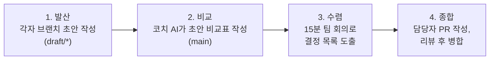

# AI와 기획 문서 쓰기: 발산·수렴 프로세스 정리

기획 문서를 AI와 함께 쓸 때, AI가 마음대로 없는 기능을 지어내거나(환각) 팀원마다 의견이 달라 문서가 뒤죽박죽되는 문제를 겪을 수 있다. 이를 막기 위한 "발산-수렴" 작성 원칙과, 문서 4종을 ID로 연결하는 구조, 그리고 Git으로 여러 사람의 의견을 모으는 절차를 정리했다.

## 1. 핵심 원칙: 발산과 수렴

- **발산(Divergence)**: 초안 작성 시 기획 파트너 역할의 AI가 미처 생각하지 못한 요구·예외·정책 후보를 `[제안](근거 1줄 포함)` 형식으로 덧붙여 사고의 폭을 넓힌다.
- **수렴(Convergence)**: 팀 회의를 통해 AI의 `[제안]`을 검토하고, 하나씩 채택(태그 제거)하거나 거절(이유 작성)한다.
- **검토했으나 제외**: 거절된 제안은 문서 하단의 별도 표에 이유와 함께 남긴다. 이렇게 하면 이후 제작 단계에서 AI가 이미 거절된 기능을 임의로 되살려 지어내는 현상(환각)을 막을 수 있다.

## 2. 기획 문서 4장과 ID Chain

문서는 S(단계) → R(요구) → F(기능) → P(정책) 순서로 작성되고, 서로의 ID를 참조해 추적할 수 있도록 구성한다.

| 문서 | 핵심 역할 | 작성 문장 특징 / 구성 요소 |
|---|---|---|
| 02. 업무 분석 (Workflow) | 사용자의 현재 업무(As-Is) 흐름을 짚고, 앱 도입 후(To-Be) 변화를 정리한다 | 행위자(A), 단계(S: 행동/감정/불편/To-Be 1줄), 흐름 및 분기 |
| 03. 요구사항 정의 (Requirements) | 불편을 해소하기 위해 사용자가 원하는 바를 서술한다 | 주어는 행위자, "~할 수 있어야 한다" 형식 (앱 부품명·기술 용어 배제) |
| 04. 주요 기능 (Features) | 요구사항을 만족시키기 위해 앱이 해주는 동작을 정의한다 | 트리거·입력·결과·예외 4칸 작성, 우선순위 2축(MVP / v2) |
| 05. 정책 정의서 (Policy) | 기능 동작 시 적용되는 규칙 및 제한을 정의한다 | "~할 수 없다 · 까지" 형식, 위반 시 보이는 화면, 상태값 전이 조건 |

문서 각 항목이 자기 위 단계(S→R→F→P)의 ID를 참조하기 때문에, 예를 들어 정책(P) 하나가 어떤 기능(F)에서, 어떤 요구사항(R)에서, 어떤 업무 단계(S)에서 비롯됐는지를 역으로 추적할 수 있다.

## 3. 에이전트가 읽을 수 있는 문서의 3대 조건

- **ID 추적성**: 표의 첫 열과 참조 열에 ID(A, S, R, F, P)를 명시해 문서 간 연결 관계를 명확히 한다.
- **검증 가능한 문장**: "편리하게"처럼 주관적인 단어를 배제하고, 눈에 보이는 트리거·결과·예외로 구체화한다.
- **미확정 요소의 `[?]` 처리**: 아직 모르거나 정하지 못한 부분은 빈칸으로 남기지 않고 `[?]`로 표기한다. 문서 머리말에 "여기 없는 것은 지어내지 말 것"을 명시해, AI가 빈칸을 임의로 채워 넣는 것을 막는다.

## 4. Git 기반 의견 종합 프로세스 (4단계)

여러 명이 각자 초안을 쓰고 하나로 모으는 과정을, Git의 브랜치·PR 개념을 빌려 4단계로 정리했다.

1. **각자 초안 작성 (발산)**: 개인 브랜치(`draft/*`)에서 파트너 AI와 인터뷰하며 초안을 작성하고 `main`에 병합한다. 서로 다른 파일명을 쓰기 때문에 이 단계에서는 충돌이 나지 않는다.
2. **비교표 생성 (코치)**: 종합 담당자가 `main`에서 코치 AI를 활용해 초안들의 공통점, 차이점, 단독 의견, `[제안]` 목록을 표로 뽑아낸다.
3. **팀 수렴 회의**: 비교표를 바탕으로 15분간 회의를 거쳐 채택·거절·결정 목록을 작성한다. 결정하지 못한 항목은 `[?]`로 남긴다.
4. **종합 문장 작성 & PR 병합**: 담당자 1인이 결정 목록을 반영해 최종 문서를 작성하고 PR을 올린다. 팀원 전원이 리뷰하고 승인(Approve)한 뒤에 병합한다. 이 단계에서 Git 충돌이 나더라도 단순 에러가 아니라 "의견 차이"로 인식하고 해결한다.

## 5. 에이전트 역할 분담

| 에이전트 | 역할 | 특징 |
|---|---|---|
| 기획 파트너 (planning-partner) | 대화와 인터뷰로 작성자의 생각을 끌어내고, `[제안]`을 통해 발산을 돕는다 | 문서를 직접 쓰는 "쓰는 손"이지만, 스스로 최종 결정은 내리지 않는다 |
| 코치 (product-planner) | 초안 비교표 작성, ID 연계 누락 검사, 모호한 문장 지적을 수행한다 | 문서를 수정하지 않는 읽기 전용 "비교하는 눈" |

두 에이전트의 역할이 나뉘어 있는 이유는, "쓰는 역할"과 "검증하는 역할"을 한 에이전트가 같이 맡으면 자신이 쓴 초안을 스스로 냉정하게 비교·지적하기 어렵기 때문이라고 이해했다.

## 오늘 정리

- AI와 기획 문서를 쓸 때는 "일단 넓게 제안받고(발산), 팀이 모여 좁힌다(수렴)"는 두 단계를 분리하는 게 핵심이었다.
- 거절된 제안도 지우지 않고 표에 남겨야, 나중에 AI가 같은 제안을 환각처럼 다시 꺼내는 걸 막을 수 있다는 점이 인상 깊었다.
- 문서 4종(업무 분석·요구사항·기능·정책)을 ID로 서로 연결해 두면, 정책 하나가 왜 존재하는지 업무 단계까지 거슬러 추적할 수 있다.
- "쓰는 에이전트"와 "검증하는 에이전트"를 분리하는 것도 같은 맥락의 원칙이라는 걸 알았다.

## 더 학습하면 좋은 개념

- **정보 구조(Information Architecture)** — S/R/F/P 문서 구조는 결국 정보를 계층적으로 조직하는 방법이다. 이 분야의 원칙을 알면 다른 종류의 문서 체계를 설계할 때도 응용할 수 있다.
- **추적성 매트릭스(Traceability Matrix)** — 요구사항부터 구현까지 ID로 추적하는 방식은 소프트웨어 공학에서 오래 쓰인 기법이다. 왜 이런 추적 체계가 필요한지 원리를 알면 ID Chain 설계가 더 명확해진다.
- **Git 브랜치 전략(Branching Strategy)** — 이번 글의 4단계 프로세스는 결국 Git의 브랜치·PR 흐름을 의사결정 프로세스에 빌려 쓴 것이다. Git Flow, Trunk-Based Development 같은 실제 전략을 알면 왜 이 구조가 충돌을 줄이는지 더 잘 이해된다.
- **멀티 에이전트 오케스트레이션(Multi-agent Orchestration)** — 기획 파트너와 코치처럼 역할이 다른 에이전트를 나누어 쓰는 방식은, 여러 AI 에이전트를 조합해 하나의 작업을 처리하는 더 큰 개념의 한 사례다.

## 참고 자료
- [Git 공식 문서 - 브랜치란 무엇인가](https://git-scm.com/book/ko/v2/Git-브랜치-브랜치란-무엇인가)
- [GitHub Docs - Pull Request 리뷰하기](https://docs.github.com/ko/pull-requests/collaborating-with-pull-requests/reviewing-changes-in-pull-requests/reviewing-proposed-changes-in-a-pull-request)
- [Claude Docs - Subagents](https://docs.claude.com/en/docs/claude-code/sub-agents)
