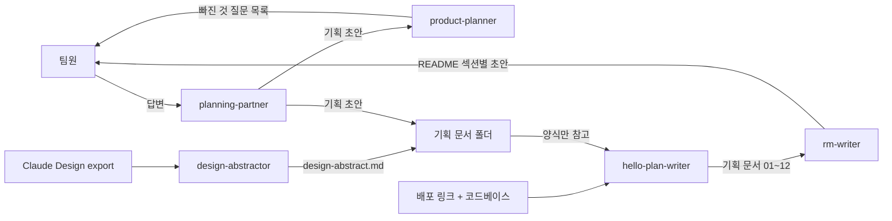

## 들어가며 (Situation)

2주간(2026.09.07 ~ 09.21) 4인 팀으로 **p:nder(pinder)** 라는 서비스를 만들었다. 여러 장소를 이동해야 하는 여행객이 목적지만 입력하면 AI가 동선과 일정을 자동으로 짜주는 서비스다. 기획 저장소(`hello-planning`)와 개발 저장소(`pinder`)를 나눠서 진행했는데, 같은 팀이 같은 2주 동안 작업했는데도 두 저장소의 협업 방식이 완전히 달랐고, 그 차이에서 배운 점이 많아 정리해둔다.

## 문제 상황 (Task)

- **기획 단계**: PR을 열긴 했지만, 13건 중 7건만 병합되고 6건(#6, #11~14, #16)은 리뷰 코멘트까지 받고도 끝내 병합되지 못한 채 방치됐다. 결국 담당자가 PR 없이 `main`에 파일을 직접 복사해 넣는 것으로 마무리됐다.
- **개발 단계 초반**: `feat/login-signup-screens` 같은 브랜치 이름표가 여럿 있었지만, 실제로는 부모 커밋이 1개뿐이라 **분기된 적이 없는** 브랜치였다. 팀원 전원이 `main`에 직접 커밋하고, 로컬에서 `git pull`로 생긴 충돌을 그때그때 해결하는 방식이 반복됐다(pull 충돌 병합 커밋만 94개).
- **이슈 관리**: GitHub 이슈 3건 모두 담당자(assignee) 필드가 비어 있고 댓글이 0건이며, 한 번도 닫힌 적이 없었다. 체크리스트 진행률도 이슈마다 제각각이라(6/6, 0/18, 1/219) 실행 추적용이 아니라 "todo 메모장"에 가까웠다.
- **AI 기획 자동화의 위험**: 기획 문서를 AI와 같이 쓰다 보면, AI가 근거 없는 내용을 그럴듯하게 지어내는(환각) 문제가 생길 수 있다. 실제로 배포된 서비스에도 비슷한 패턴의 버그가 있었다 — AI가 추천한 장소의 좌표를 못 찾으면, 화면은 이를 알리지 않고 **가짜 이동시간·지하철 노선명을 지어내 보여주는** 결함이 있었다.

## 해결 과정 (Action)

### 1) AI 에이전트 5개로 기획 문서 파이프라인을 나눠 구성

"화면을 만드는" 에이전트 대신, **기획·문서 작업만 나눠 맡는 에이전트 5개**를 저장소에 따로 정의했다. 한 에이전트가 인터뷰부터 검증, 코드 역산, 최종 문서화까지 다 하게 하지 않고, 역할을 쪼갠 게 핵심이었다.



| 에이전트 | 역할 | 제약 |
|---|---|---|
| `planning-partner` | 팀 답변을 인터뷰 형식으로 받아 기획 문서 초안 작성 | 팀 대신 결정하지 않음 |
| `product-planner` | 기획 문서의 빈 칸·모호한 문장 검증 | 읽기 전용, 답을 대신 채우지 않음 |
| `design-abstractor` | 디자인 산출물을 코드 기준으로 요약 | 원본 수정 금지 |
| `hello-plan-writer` | 배포된 서비스를 코드·화면 기준으로 역산해 기획 문서화 | 추측·`[제안]`/`[?]` 태그 금지, 근거 없으면 "미확인" |
| `rm-writer` | 위 문서들을 종합해 최종 문서 작성 | 팀원 섹션별 승인 절차 필수 |

에이전트마다 입력·출력·쓰기 권한을 확실히 나눠두니, "이 에이전트가 왜 이런 내용을 썼는지" 추적하기가 쉬워졌다.

### 2) "계획"이 아니라 "지금 실제로 동작하는 것"만 쓰게 하기

`hello-plan-writer`에는 아래 규칙을 절대 규칙으로 넣었다.

```
1. Write/Edit는 오직 지정된 폴더 안의 파일에만 한다.
2. 참고 문서는 양식(표 구조·섹션 순서)만 참고하고 내용은 전부 무시한다.
3. 추측하지 않는다. [제안]·[?] 태그를 쓰지 않는다. 확인이 안 되면 "미확인 — 근거 없음"으로만 표시한다.
4. 모든 서술 항목에는 근거를 남긴다. 형식: (근거: src/app/matches/page.tsx)
5. "계획"이 아니라 "실제로 지금 동작하는 것"만 쓴다.
```

이렇게 배포된 코드를 기준으로 기획 문서를 거꾸로 검증하는 과정에서, 위에서 말한 **좌표 매칭 실패 버그**를 코드 추적(`AiGenerateWizard.tsx` → `PlannerClient.tsx` → `route-engine.ts`)으로 실제로 찾아냈다. 이후 좌표를 못 찾으면 대체 후보로 최대 3회 재시도하고, 그래도 실패하면 해당 장소를 제외하며 "좌표 매칭에 실패했습니다" 안내 모달을 띄우도록 고쳤다.

### 3) 방치됐던 "PR 기반 협업"을 문서화 작업에서 다시 시도

기획 단계에서 실패했던 "PR 생성 → 리뷰 → 병합" 흐름을, 09-22 README 작성 작업에서 팀원별로 섹션을 나눠(디자인 시스템/에이전트·규칙/협업·데모/회고, 그리고 포맷 정리 PR 1건까지 총 5건) 다시 시도했다. 이번에는 5건 모두 실제로 GitHub의 "Merge pull request" 버튼을 눌러 병합했다 — 이 저장소가 생긴 이후 처음으로 성공한 PR 기반 병합이었다. 병합 과정에서 먼저 들어와 있던 다른 커밋과 충돌이 나기도 했는데, 각자 `main`을 다시 merge해서 해결하는 방식으로 넘어갔다.

### 4) 반복된 충돌에서 확인한 협업의 구멍

- PR에 리뷰 코멘트가 12건이나 달렸는데도, 반영·재승인까지 이어지지 못하고 결국 PR 없이 파일만 옮겨지는 것으로 끝난 사례가 있었다. **리뷰는 있었지만 "반영 후 재병합"까지 절차가 끝까지 지켜지지 않은 것**이 문제였다.
- 한 팀원이 추가한 코드 3줄을, 다른 팀원이 사전 설명 없이 revert했다가 원래 작성자가 다시 적용하는 일이 있었다. 되돌린 이유가 기록에 남지 않아서 왜 그랬는지 끝내 알 수 없었다 — 같은 영역을 건드릴 땐 먼저 공지하고, 되돌릴 땐 이유를 남기는 습관이 필요하다는 걸 깨달았다.
- 화면 하나(`PlannerClient.tsx`)와 스타일 파일 하나(`planner.module.css`)를 네 명이 동시에 반복 수정하면서, 버튼 위치 하나를 5~7번씩 고치는 일이 벌어졌다. 레이아웃 기준(z-index, 앵커 위치)을 먼저 정하지 않고 각자 그때그때 고친 결과였다.

## 결과 (Result)

| 항목 | 기획 단계(09-07~09-11) | 09-22 README 문서화 |
|---|---|---|
| 연 PR 수 | 13건 | 5건 |
| 병합된 PR 비율 | 7건 (약 54%) | 5건 (100%) |
| 병합 방식 | 자가병합 다수 + 방치 후 직접 복사 | 팀원별 브랜치 → 실제 리뷰·병합 버튼 사용 |

- 코드 역산 검증 과정에서 찾은 좌표 매칭 버그는, 재시도 로직과 실패 안내 모달을 추가한 뒤로는 가짜 데이터 없이 실패한 장소만 제외되도록 바뀌었다.
- "계획"이 아니라 "실제 동작"만 기록하게 한 규칙 덕분에, 기획 문서와 실제 코드 사이의 괴리(예: 색상 토큰 규칙 미준수, 다크모드 미대응)를 스스로 찾아내 문서에 남길 수 있었다.
- 가장 크게 배운 점은, PR 기반 협업이 "한 번 정해두면 계속 지켜지는 규칙"이 아니라는 것이다. 기획 단계에서 실패한 뒤 방치됐다가, 의식적으로 다시 시도한 09-22에야 처음으로 제대로 작동했다.

## 더 학습하면 좋은 개념

- **브랜치 전략 (Git Flow / Trunk-Based Development)** — 이번 프로젝트에서 "브랜치 이름은 있지만 실제로는 분기되지 않은" 상태를 겪었다. 표준 브랜치 전략을 제대로 알면, 왜 브랜치를 짧게 유지하고 자주 병합해야 하는지 더 명확해질 것 같다.
- **코드 리뷰 문화** — 리뷰 코멘트는 달렸는데 반영·재병합까지 이어지지 못한 사례가 있었다. 리뷰를 "의견 남기기"가 아니라 "병합까지 책임지는 절차"로 만드는 방법을 더 찾아보고 싶다.
- **실패에 관대한 설계 (Graceful Degradation)** — 좌표를 못 찾았을 때 가짜 데이터 대신 "해당 항목만 제외하고 계속 진행"하도록 고친 게 이 개념의 실제 사례였다. 어떤 상황에서 기능을 줄여서라도 서비스를 유지할지 설계 원칙으로 정리해보고 싶다.
- **AI 환각 방지 패턴 (Grounding)** — `[제안]`/`[확인 필요]` 태그로 AI가 보탠 내용과 확정된 사실을 구분한 게 이번 프로젝트에서 유효했다. RAG나 인용(citation) 기반 응답 생성처럼, AI 응답에 근거를 강제하는 다른 방법들도 찾아보면 좋을 것 같다.

## 참고 자료
- [Git 공식 문서 - 브랜칭 모델](https://git-scm.com/book/ko/v2/Git-%EB%B8%8C%EB%9E%9C%EC%B9%98-%EB%B8%8C%EB%9E%9C%EC%B9%98%EC%9D%98-%EC%A2%85%EB%A5%98)
- [GitHub Docs - Pull Request 리뷰하기](https://docs.github.com/ko/pull-requests/collaborating-with-pull-requests/reviewing-changes-in-pull-requests/reviewing-proposed-changes-in-a-pull-request)
- [Claude Docs - Subagents](https://docs.claude.com/en/docs/claude-code/sub-agents)
