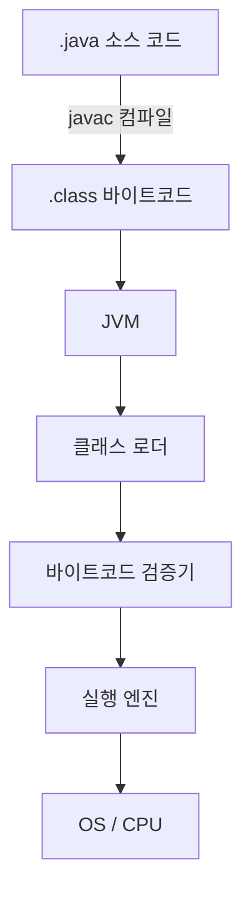
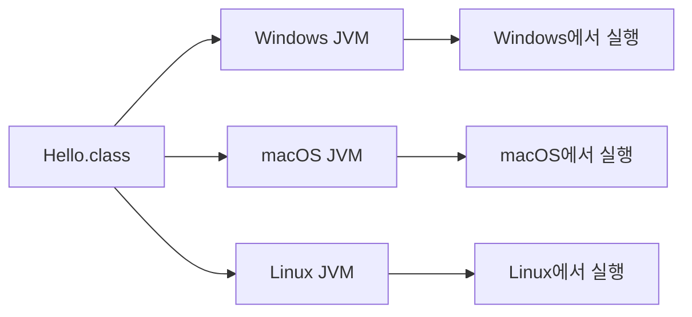

[이전 글]({{ site.baseurl }}/java-jdk-jre-jvm.html)에서 JDK/JRE/JVM 같은 개발 환경을 정리했고, 이번엔 실제로 자바 코드를 작성하면 그게 어떻게 실행되는지를 정리한다.

## 1. 자바 프로그램의 기본 구조

자바 코드는 반드시 **클래스** 안에서 동작한다. 클래스 이름은 관례적으로 대문자로 시작한다.

```java
public class Hello {
    public static void main(String[] args) {
        System.out.println("Hello, Java!");
    }
}
```

```text
Hello, Java!
```

- `class Hello { ... }`: `Hello`라는 이름의 클래스를 정의한다. 자바에서는 모든 코드가 클래스 내부에 있어야 한다.
- `public static void main(String[] args) { ... }`: 프로그램이 시작되는 지점(entry point)이다. JVM은 프로그램을 실행할 때 이 메서드를 가장 먼저 찾아서 실행한다.
- `System.out.println("Hello, Java!");`: 괄호 안의 문자열을 콘솔에 출력하고 줄바꿈한다.
- 중괄호 `{`를 열면 반드시 `}`로 닫아야 하고, 코드는 기본적으로 위에서 아래로 순서대로 실행된다.

## 2. 파일 이름과 클래스 이름

`public class Hello`로 선언했다면, 이 코드를 담은 파일 이름은 반드시 `Hello.java`여야 한다.

```text
public class Hello
→ Hello.java
```

- `public`으로 선언한 클래스의 이름과 파일 이름은 같아야 한다.
- 자바는 대소문자를 구분하므로, `Hello`와 `hello`는 서로 다른 이름이다.
- 모든 문장은 세미콜론(`;`)으로 끝난다.

## 3. 패키지 이름

수업에서는 패키지 이름을 "최상위 이름 → 회사/조직 이름 → 프로젝트 이름" 순서로 점(`.`)을 찍어 구성하는 방식을 배웠다.

```text
com.naver.sports
```

이건 네이버에서 진행하는 스포츠 관련 프로젝트의 패키지 이름이라는 예시였다. 다만 이게 자바의 절대적인 패키지 네이밍 규칙은 아니고, 수업에서 배운 기본적인 구성 방식 정도로 이해하면 된다.

## 4. 자바 실행 과정 한눈에 보기



## 5. 컴파일러 — 소스 코드를 바이트코드로

컴파일러는 "번역기"라고 이해하면 쉽다. `javac`가 사람이 읽는 `.java` 소스 코드를 JVM이 읽을 수 있는 `.class` 바이트코드로 번역(컴파일)한다.

```powershell
javac Hello.java
```

명령을 실행하면 같은 폴더에 `Hello.class` 파일이 생성된다.

## 6. 바이트코드란

`.class` 파일 안에 담기는 내용이 바로 바이트코드다.

- JVM이 이해할 수 있는 **중간 형태**의 명령어다.
- 특정 CPU가 바로 실행하는 기계어와는 다르다.
- JVM이 이 바이트코드를 읽어서 실제 실행으로 옮긴다.

## 7. JVM이 바이트코드를 실행하는 과정

- **클래스 로더**: `.class` 파일을 메모리에 올린다.
- **바이트코드 검증기**: 올라온 바이트코드가 안전한지 검사한다.
- **실행 엔진**: 실제 실행을 담당한다. 내부에는 인터프리터와 JIT 컴파일러가 함께 관여한다.

이 세 단계는 "필요한 클래스가 처음 쓰일 때" 그때그때 일어난다. 프로그램에 클래스가 여러 개 있어도 전부 한 번에 로드·검증되는 게 아니라, 실행되면서 필요해질 때마다 그 클래스가 로드되는 식으로 진행된다는 정도로 이해하면 된다.

실행 엔진 안에서는 인터프리터가 바이트코드를 그때그때 해석해서 실행하고, 같은 코드가 반복해서 자주 실행되면(hot code) JIT(Just-In-Time) 컴파일러가 그 부분을 네이티브 코드로 변환해 더 빠르게 실행되도록 돕는다. 어떤 코드를 언제 변환할지 같은 세부 최적화 방식까지는 이번 수업에서 다루지 않았다.

## 8. Write Once, Run Anywhere



`.class` 파일 자체는 특정 CPU의 기계어가 아니라 JVM을 위한 바이트코드이기 때문에, 운영체제나 CPU가 달라도 그에 맞는 JVM만 있으면 같은 `.class` 파일을 그대로 실행할 수 있다. "한 번 작성하면 어디서나 실행된다(Write Once, Run Anywhere)"는 말이 여기서 나온다.

## 오늘 정리

- 자바 코드는 `.java` → (javac) → `.class` → (JVM) → 실행이라는 한 방향 흐름을 탄다.
- 컴파일과 실행이 분리돼 있고, 실행은 각 OS의 JVM이 바이트코드를 해석·변환하며 담당한다는 게 핵심이었다.
- 이 흐름을 알고 나니, [이전 글]({{ site.baseurl }}/java-jdk-jre-jvm.html)에서 정리한 JDK 안의 도구들(`javac`, `java`)이 이 과정 중 정확히 어떤 단계를 맡는지도 같이 정리됐다.

## 더 학습하면 좋은 개념

- **인터프리터 vs 컴파일 언어** — 자바는 컴파일과 인터프리터 실행을 함께 쓰는 구조다. C처럼 완전히 기계어로 컴파일되는 언어, 파이썬처럼 인터프리터로만 실행되는 언어와 비교해보면 자바의 위치가 더 명확해진다.
- **JIT 컴파일 최적화** — 오늘은 "반복되면 빨라진다" 정도로만 이해했는데, HotSpot JVM이 실제로 어떤 기준으로 코드를 최적화하는지 더 찾아보고 싶다.
- **패키지와 디렉터리 구조** — `com.naver.sports`처럼 점으로 구분한 패키지 이름이 실제로는 폴더 구조와 대응된다는 점을 다음에 프로젝트를 만들며 직접 확인해보고 싶다.

## 참고 자료
- [Oracle - Java 언어 사양(Java Language Specification)](https://docs.oracle.com/javase/specs/)
- [Oracle - javac 명령어 문서](https://docs.oracle.com/en/java/javase/21/docs/specs/man/javac.html)
