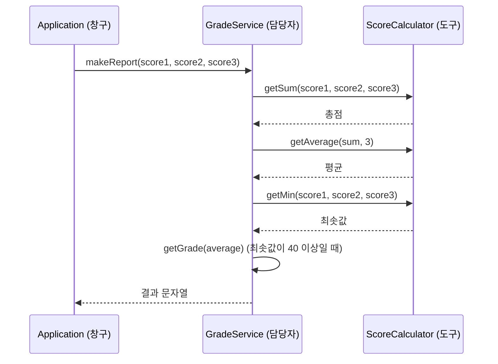

"평균이 90점이어도 한 과목이 40점 미만이면 무조건 F"라는 규칙은 어디에서 검사해야 할까?  
팀 프로젝트(대학생활 계산기)에서 학점 계산 기능을 맡아 이슈에 이 질문을 적어 두고 시작했다.  
처음 쓴 코드에서 컴파일 오류와 논리 오류를 하나씩 찾아 고치며 답을 찾았다.  
같은 팀의 이전 프로젝트는 [포카칩 계산기 글]({{ site.baseurl }}/pokachip-cafe-calculator.html)에서 정리했다.

> **TL;DR**
> - 과락은 평균이 아니라 **최솟값**으로 판단한다. 등급 메소드(`getGrade`)는 평균만 받으므로, 과락 검사는 `makeReport`에서 `getGrade`를 호출하기 전에 한다.
> - 처음 작성한 코드는 변수 이름 중복, 선언하지 않은 변수, 반환값 누락 등으로 컴파일되지 않았고, `getMin`과 `getAverage`에도 논리 오류가 있었다.
> - 이슈에 적은 규칙(점수 범위, 등급 기준, 과락)을 메소드 단위로 나누면 호출 흐름이 `Application` → `GradeService` → `ScoreCalculator`로 정리된다.

## 1. 요구사항: 규칙을 내 말로 정리하기

이슈에 적은 기능은 세 과목의 점수를 입력받아 총점, 평균, 등급을 알려주는 것이다.  
규칙은 세 가지다.

| 번호 | 규칙 | 처리 |
|---|---|---|
| 1 | 점수가 0~100 범위를 벗어나면 `점수는 0-100 사이로 입력하세요.`를 반환한다 | 입력 검사 |
| 2 | 평균 기준으로 A(90 이상), B(80 이상), C(70 이상), D(60 이상), F(60 미만) | 등급 계산 |
| 3 | 40점 미만인 과목이 하나라도 있으면 평균과 상관없이 F(과락) | 예외 규칙 |

만들 클래스와 메소드는 이슈에서 다음과 같이 정했다.

| 클래스 | 메소드 | 하는 일 |
|---|---|---|
| `ScoreCalculator` | `int getSum(int score1, int score2, int score3)` | 세 점수의 합을 구한다 |
| `ScoreCalculator` | `double getAverage(int sum, int count)` | 합계와 과목 수로 평균을 구한다 |
| `ScoreCalculator` | `int getMin(int score1, int score2, int score3)` | 가장 낮은 점수를 구한다 |
| `GradeService` | `String getGrade(double average)` | 평균으로 등급 문자열을 반환한다 |
| `GradeService` | `String makeReport(int score1, int score2, int score3)` | 총점, 평균, 등급을 담은 결과 문자열을 반환한다 |

계산 도구(`ScoreCalculator`)와 규칙을 적용하는 담당자(`GradeService`)로 역할을 나눴다.

## 2. 호출 흐름: 창구에서 도구까지

`Application`은 입력을 받는 창구이고, 규칙을 적용하는 일은 `GradeService`가 맡는다.  
`GradeService`가 계산이 필요할 때 `ScoreCalculator`를 부른다.  
이 흐름을 시퀀스 다이어그램으로 그렸다.



## 3. 처음 작성한 코드: 컴파일되지 않았다

처음에는 이슈의 메소드 이름만 보고 각 클래스를 바로 채웠다.  
아래는 그때의 코드를 그대로 옮긴 것이고, **컴파일되지 않는다.**

`Application`의 `case 2` 블록이다.

```java
case 2: {
    System.out.println("과목 1 점수 : ");
    int score1 = sc.nextInt();

    System.out.println("과목 2 점수 : ");
    int score2 = sc.nextInt();

    System.out.println("과목 3 점수 : ");
    int score3 = sc.nextInt();

    GradeService calculator = new GradeService();
    calculator.getGrade(score1, score2, score3);
    calculator.makeReport(score1, score2, score3);

    ScoreCalculator calculator = new ScoreCalculator();
    calculator.getSum(score1, score2, score3);
    calculator.getAverage(sum, count);
    calculator.getMin(score1, score2, score3);
    break;
}
```

`ScoreCalculator`이다.

```java
package com.pokachip.campus;

public class ScoreCalculator {
    public int getSum(int score1, int score2, int score3){
        return score1 + score2 + score3;
    }

    public double getAverage(int sum, int count) {
        return sum / count;
    }

    public int getMin(int score1, int score2, int score3){
        if (score1 < score2 && score1 < score3) {
        return score1;
        } else if (score2 < score1 && score2 < score3) {
        return score2;
    } else {
        return score3;
    }

}

(a < b) ? (a < c  ?  a : c) : (b < c ? b : c)
```

`GradeService`이다.

```java
package com.pokachip.campus;

public class GradeService {

    public String getGrade(double average){
        if (average>=90) {
            System.out.println("A");
        }else if (average>=80){
            System.out.println("B");
        }else if (average>=70){
            System.out.println("C");
        } else if (average>=60) {
            System.out.println("D");
        } else if (average>=40 {
            System.out.println("F");
        } else {
        System.out.println("과락입니다.")
    }

    public String makeReport(int score1, int score2, int score3){
            if (score1 < 0 || score1 > 100 || score2 < 0 || score2 > 100 || score3 < 0 || score3 > 100) {
            sout( "점수는 0~100 사이로 입력하세요." );
    } else{
                  System.out.println( "총점 " + getSum + "점, " + "평균 : " + getAverage + "점, " + "등급 : " + getGrade );
    }
}
```

## 4. 무엇이 잘못됐을까

코드를 다시 읽으며 찾은 문제를 파일별로 정리했다.

| 위치 | 문제 | 왜 문제인가 |
|---|---|---|
| `Application` | 변수 `calculator`를 `GradeService`와 `ScoreCalculator`로 두 번 선언 | 같은 영역에서 같은 이름의 변수를 다시 선언할 수 없다 |
| `Application` | `getGrade(score1, score2, score3)` 호출 | `getGrade`는 `double` 하나만 받도록 선언했다 |
| `Application` | `getAverage(sum, count)`에서 `sum`, `count` | 선언한 적 없는 변수다 |
| `Application` | 반환값을 변수에 받지 않고 메소드만 호출 | 계산 결과가 버려진다 |
| `ScoreCalculator.getAverage` | `sum / count` | 정수끼리 나누면 소수점이 잘린 뒤 `double`로 바뀐다 |
| `ScoreCalculator.getMin` | 점수가 같을 때 | 아래에서 설명한다 |
| `ScoreCalculator` | 클래스 닫는 중괄호가 없고, 마지막 줄의 삼항식이 클래스 안에 문장으로 놓임 | 컴파일 오류다. 삼항식은 메모용이면 주석으로 둬야 한다 |
| `GradeService.getGrade` | 반환형은 `String`인데 `return` 없이 `println`만 사용 | 반환형이 `String`이면 모든 경로에서 값을 반환해야 한다 |
| `GradeService.getGrade` | `else if (average>=40 {`, `println("과락입니다.")` 뒤 세미콜론 | 괄호와 세미콜론 누락이다 |
| `GradeService.getGrade` | 과락 조건이 평균(`average>=40`) 기준 | 규칙은 "한 과목이라도 40점 미만"이라 최솟값 기준이다 |
| `GradeService.makeReport` | `sout(...)` | IDE에서 자동완성으로 `System.out.println`이 되는 단축 입력이다. 그대로는 자바 문법이 아니다 |
| `GradeService.makeReport` | `getSum`, `getAverage`, `getGrade`를 괄호와 객체 없이 변수처럼 사용 | 메소드 호출은 `객체.메소드(값)` 형태이고, 이 메소드들은 `ScoreCalculator` 소속이다 |
| `GradeService.makeReport` | 반환형은 `String`인데 `return` 없음 | 이슈에는 결과를 반환하는 것으로 정해 두었다 |

### getMin은 점수가 같으면 틀린다

`getMin`은 `score1 < score2 && score1 < score3`처럼 부등호(`<`)로만 비교한다.  
두 점수가 같으면 어느 쪽도 "더 작다"가 되지 않아 마지막 `else`로 떨어진다.  
점수가 `50, 50, 60`이면 `score1 < score2`는 거짓이고 `score2 < score1`도 거짓이어서, 최솟값 50이 아니라 `score3`인 `60`을 반환한다.  
마지막 줄에 메모해 둔 삼항식 `(a < b) ? (a < c ? a : c) : (b < c ? b : c)`는 같은 경우에도 올바른 값을 준다.  
두 점수가 같으면 `b < c ? b : c` 쪽을 타서 `50`을 반환하기 때문이다.

### 평균은 정수 나눗셈 때문에 소수점이 사라진다

`sum / count`에서 `sum`과 `count`가 모두 `int`이면 결과도 `int`다.  
합계 250을 3으로 나누면 `83.333...`이 아니라 `83`이고, 이 `83`이 `double`로 바뀌어 `83.0`이 된다.  
등급은 기준이 정수(90, 80, ...)라서 영향이 없지만, 화면에 보여주는 평균에서 소수점 아래가 사라진다.  
둘 중 하나를 `double`로 바꿔 나누면 해결된다.

## 5. 궁금했던 점: 과락은 어디서 검사할까

이슈에 남겼던 질문이다.  
"40점 미만 과목이 있으면 평균과 상관없이 F"를 어떻게 개발할지 몰랐다.

처음 코드는 `getGrade` 안에 `average>=40` 같은 조건을 넣었다.  
하지만 `getGrade(double average)`는 평균 하나만 받아서 과목별 점수를 알 수 없다.  
평균이 70이어도 점수가 `90, 85, 35`일 수 있기 때문이다.  
과락은 **최솟값이 40 미만인지**로 판단해야 하고, 그 정보는 `makeReport`가 갖고 있다.

그래서 `makeReport`에서 최솟값을 먼저 확인한다.

| 순서 | 검사 | 결과 |
|---|---|---|
| 1 | 점수가 0~100 범위를 벗어났는가 | 맞으면 안내 메시지를 반환하고 끝낸다 |
| 2 | 최솟값이 40 미만인가 | 맞으면 평균과 상관없이 `F (과락)` |
| 3 | 그 외 | 평균으로 `getGrade`를 호출해 등급을 구한다 |

규칙 중 예외(과락)를 일반 규칙(평균 기준 등급)보다 먼저 검사하는 것이 핵심이다.

## 6. 고친 코드

아래는 위 문제를 고친 코드이고, 직접 실행해 확인하지는 않았다.  
`ScoreCalculator`의 `getMin`은 같은 점수를 처리하는 `Math.min`으로 바꿨다.

```java
package com.pokachip.campus;

public class ScoreCalculator {

    public int getSum(int score1, int score2, int score3) {
        return score1 + score2 + score3;
    }

    public double getAverage(int sum, int count) {
        return (double) sum / count;
    }

    public int getMin(int score1, int score2, int score3) {
        return Math.min(score1, Math.min(score2, score3));
    }
}
```

`GradeService`는 `ScoreCalculator`를 필드로 갖고, 등급 문자열과 결과 문자열을 `return`으로 돌려준다.

```java
package com.pokachip.campus;

public class GradeService {

    private final ScoreCalculator calculator = new ScoreCalculator();

    public String getGrade(double average) {
        if (average >= 90) {
            return "A";
        } else if (average >= 80) {
            return "B";
        } else if (average >= 70) {
            return "C";
        } else if (average >= 60) {
            return "D";
        } else {
            return "F";
        }
    }

    public String makeReport(int score1, int score2, int score3) {
        if (score1 < 0 || score1 > 100
                || score2 < 0 || score2 > 100
                || score3 < 0 || score3 > 100) {
            return "점수는 0-100 사이로 입력하세요.";
        }

        int sum = calculator.getSum(score1, score2, score3);
        double average = calculator.getAverage(sum, 3);
        int min = calculator.getMin(score1, score2, score3);

        String grade = (min < 40) ? "F (과락)" : getGrade(average);

        return "총점 " + sum + "점, 평균 : " + average + "점, 등급 : " + grade;
    }
}
```

`Application`의 `case 2`는 창구 역할만 한다.  
입력을 받아 `GradeService`에 넘기고, 돌려받은 문자열을 출력한다.

```java
case 2: {
    System.out.print("과목 1 점수 : ");
    int score1 = sc.nextInt();

    System.out.print("과목 2 점수 : ");
    int score2 = sc.nextInt();

    System.out.print("과목 3 점수 : ");
    int score3 = sc.nextInt();

    GradeService service = new GradeService();
    System.out.println(service.makeReport(score1, score2, score3));
    break;
}
```

## 7. 입력별 결과 예상

코드를 따라가서 적은 값이고, 실행해서 확인하지는 않았다.

| 입력 | 총점 | 평균 | 최솟값 | 결과 |
|---|---|---|---|---|
| 90, 80, 70 | 240 | 80.0 | 70 | `총점 240점, 평균 : 80.0점, 등급 : B` |
| 90, 85, 35 | 210 | 70.0 | 35 | `총점 210점, 평균 : 70.0점, 등급 : F (과락)` |
| 50, 50, 60 | 160 | 53.33... | 50 | 평균 60 미만이라 `F` |
| 105, 80, 70 | - | - | - | `점수는 0-100 사이로 입력하세요.` |

두 번째 줄이 과락 규칙의 효과를 보여준다.  
평균은 70.0으로 C에 해당하지만, 35점짜리 과목이 있어서 `F (과락)`이 된다.

## 8. 헷갈리기 쉬운 점

- **입력 안내 메시지:** 이슈에는 `점수는 0-100 사이로 입력하세요.`(하이픈)로 적었는데, 처음 코드는 `0~100`(물결표)로 썼다. 규칙에 적은 문구를 그대로 반환하도록 고쳤다.
- **메소드가 출력을 할지 반환을 할지:** 처음에는 `getGrade`가 `println`으로 출력하게 썼다. 이슈에서 `String`을 반환하도록 정했으니 출력은 `Application`이 맡고, 메소드는 값을 돌려주는 쪽이 계산과 출력을 분리하는 방법이다.
- **한계:** 과목 수가 3으로 고정이고, `sc.nextInt()`에 숫자가 아닌 입력이 들어오는 경우는 처리하지 않았다.

## 9. 정리

- 과락은 평균이 아니라 최솟값(`getMin`)으로 판단한다. 예외 규칙은 일반 규칙보다 먼저, `getGrade`를 부르기 전에 `makeReport`에서 검사한다.
- 정수끼리 나누면 소수점이 잘린다. `(double) sum / count`처럼 한쪽을 `double`로 바꿔야 한다. `getMin`은 같은 점수를 처리하는 `Math.min`으로 바꿨다.
- 메소드는 `return`으로 값을 돌려주고, 출력은 `Application`이 맡는다. 이슈에서 정한 반환형과 호출 흐름을 먼저 그리면 오류를 줄일 수 있다.

다음에 볼 것은 아래 "더 학습하면 좋은 개념"에 적었다.

## 더 학습하면 좋은 개념

- **정수 나눗셈과 형변환** — `int / int`가 소수점을 버리는 이유와 `(double)` 형변환의 순서를 알면 계산 결과가 예상과 다를 때 원인을 찾기 쉽다. [형변환 글]({{ site.baseurl }}/java-type-casting.html)에서 다룬 내용과 이어진다.
- **조건문의 검사 순서** — 예외 규칙을 먼저 검사하고 일반 규칙을 나중에 적용하는 방식이다. [조건문 글]({{ site.baseurl }}/java-conditional-statements.html)의 조건 순서와 연결해서 정리하면 좋다.
- **삼항 연산자와 `Math.min`** — 최솟값을 구하는 방법은 `if`, 삼항 연산자, `Math.min` 세 가지로 쓸 수 있다. 각각의 장단점을 비교하면 가독성을 고려해 고를 수 있다.
- **단위 테스트(JUnit)** — 경계값(40, 60, 90, 같은 점수)을 직접 입력해 보는 대신 테스트 코드로 확인하는 방법이다. 같은 점수에서 `getMin`이 틀린 것 같은 오류를 미리 찾을 수 있다.
- **입력 검증과 예외 처리** — 범위 검사는 했지만 숫자가 아닌 입력은 처리하지 않았다. `Scanner`와 `try-catch`로 보완하면 좋다.

## 참고 자료
- [Oracle - The if-then and if-then-else Statements](https://docs.oracle.com/javase/tutorial/java/nutsandbolts/if.html)
- [Oracle - Operators (정수 나눗셈과 연산자)](https://docs.oracle.com/javase/tutorial/java/nutsandbolts/operators.html)
- [Java SE API - Math.min](https://docs.oracle.com/en/java/javase/21/docs/api/java.base/java/lang/Math.html#min(int,int))
- [Java Language Specification - 15.25. Conditional Operator ? :](https://docs.oracle.com/javase/specs/jls/se21/html/jls-15.html#jls-15.25)
- [Oracle - Defining Methods](https://docs.oracle.com/javase/tutorial/java/javaOO/methods.html)
