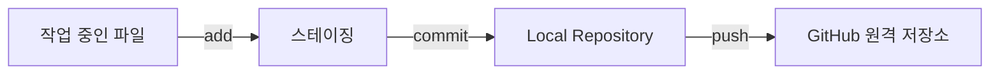
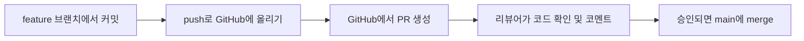

## 오늘 배운 것

commit, push가 각각 뭘 하는 건지, 그리고 언제 쓰는 건지 정리했다.

| 명령 | 하는 일 | 언제 쓰나 |
|---|---|---|
| `git commit` | 스테이징한 변경 내용을 Local Repository에 저장 지점으로 남긴다 | 작업 하나가 의미 있는 단위로 끝났을 때마다 |
| `git push` | Local Repository에 쌓인 커밋들을 GitHub(원격 저장소)로 올린다 | 로컬 작업을 GitHub에 반영하거나, 다른 사람과 공유하고 싶을 때 |

## 막혔던 것: PR(Pull Request)이 뭔지 몰랐다

commit과 push까지는 이해했는데, PR은 정확히 뭘 하는 건지 몰라서 찾아봤다.

PR은 **"내 브랜치에서 작업한 내용을 다른 브랜치(보통 main)에 합쳐달라고 요청하는 것"**이다.
그냥 `git merge`로 바로 합치는 것과 다른 점은, PR을 올리면 합치기 전에 **코드 리뷰와 논의**를 거칠 수 있다는 것이다.

즉 순서로 보면 **commit(로컬에 저장) → push(GitHub에 올림) → PR(합쳐달라고 요청 + 리뷰) → merge(실제로 합침)** 흐름이다.
push까지는 내 브랜치를 GitHub에 올리는 것뿐이고, PR을 만들어야 비로소 "리뷰 받고 합치는" 절차가 시작된다는 점이 헷갈렸던 부분이다.

## 오늘 정리

- commit은 로컬 저장, push는 GitHub 업로드라는 것까지는 알고 있었다.
- PR은 merge 전에 리뷰/논의를 거치기 위한 절차라는 걸 새로 알게 됐다.
- 다음엔 실제로 PR을 하나 만들어보면서 리뷰 코멘트가 어떻게 남는지 확인해봐야겠다.

## 참고 자료

- [GitHub Docs - About pull requests](https://docs.github.com/en/pull-requests/collaborating-with-pull-requests/proposing-changes-to-your-work-with-pull-requests/about-pull-requests)
