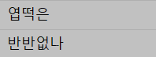

# 마크다운 문법

## 제목은 # 개수로 단계를 만들 수 있다.
### #개수에 따라 글씨가 점점 작아진다.

**굵은 글씨**
*기울여* 쓸 수 있다.

순서가 없는 목록 만들기
- 첫 번째
- 두 번째
* 세 번째
* 네 번째
    * 4-1번째

순서가 있는 목록 만들기
1. 하나
2. 두울

링크 첨부 방법
* [나의 깃허브](https://github.com/yoosoo2217/GitGui-Test.git)

이미지 첨부 방법
* 

> 인용하는 구문은 꺽쇠로 만든다.
> 남의 말이나 정의를 옮길 때 사용한다.

* `은 1 옆에 있는 것으로 (백틱)이라고 명칭
* 백틱 내부에는 코드나 명령어 적음

```
git status
git init
```

* 마크다운 문법으로 표 만들기
* | 표시는 개발 쪽에서는 OR 연산자라고도 불린다

|명령어|하는 일|
|---|---|
|git add|스테이징 영역에 파일 추가|
|git commit|로컬 저장소에 저장|

